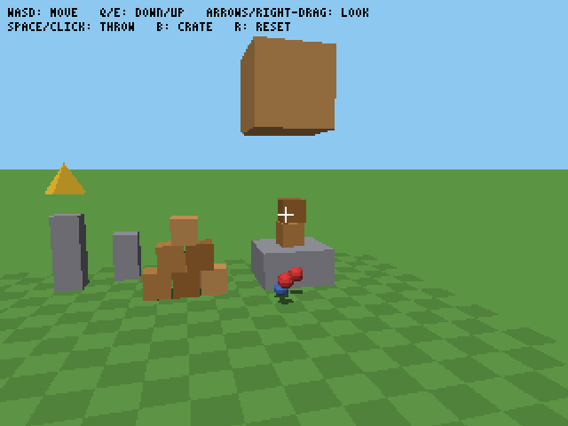
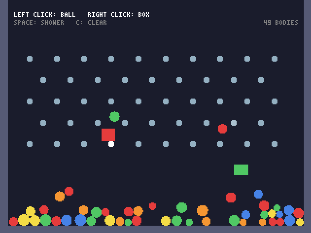
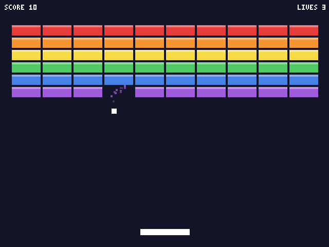
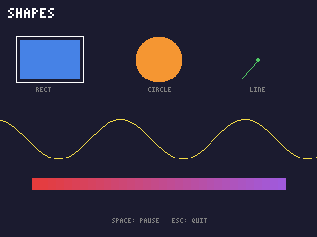

# tiny_engine: a game engine for learning Rust

A small game engine written in Rust, covering **2D graphics, 3D graphics
(on the graphics card, or on the CPU) and physics**, plus six example
programs. It was written to be read: about 4,600 lines of commented code
(57 tests included). [minifb](https://crates.io/crates/minifb) opens the
window and [wgpu](https://wgpu.rs) talks to the graphics card; everything
else is written from scratch: drawing, text, both 3D renderers, the
physics solver, input, and random numbers.

**New to Rust? Start with [TUTORIAL.md](TUTORIAL.md)**. It teaches the
language through this engine's code and explains how every part works.

<p>




</p>

## Quick start

Install Rust from <https://rustup.rs> (1.87 or newer), then:

```sh
cargo run --example world3d    # 3D world with physics: fly around, throw balls
cargo run --release --example stress3d   # thousands of spinning 3D shapes
cargo run --example physics    # 2D physics sandbox: click to drop balls and boxes
cargo run --example breakout   # the classic game
cargo run --example hello      # the smallest possible game
cargo run --example shapes     # every 2D drawing function, animated
cargo test                     # run the tests
cargo doc --open               # browse the engine's documentation
```

| Example    | Controls |
|------------|----------|
| `world3d`  | W/A/S/D move · Q/E down/up · Shift faster · arrows or right-drag to look · Space or click throws a ball · B drops a crate · R resets |
| `physics`  | Left click drops a ball · right click drops a box · Space drops a shower · C clears |
| `breakout` | Left/Right or A/D move · Space launches · P pauses · R restarts |
| `hello`    | Arrow keys or WASD move · click to teleport |
| `stress3d` | 1–6 pick 500 to 20,000 objects · O toggles orbit/fly |
| every game | **F3** shows the FPS · **F12** saves a screenshot · Escape quits |

## Features

- **2D drawing:** rectangles, circles, lines, triangles, text in a built-in
  pixel font, color blending, and `.bmp` screenshots.
- **3D rendering:** a camera with ready-made fly controls, meshes (cube,
  pyramid, sphere, checkerboard, or build your own), transforms, sunlight
  shading, a depth buffer, and near-plane clipping.
  - **On the graphics card** with wgpu (the default): meshes are cached on
    the GPU and every copy of a mesh is drawn with one draw call
    (instancing). Works with DirectX 12, Metal, Vulkan and OpenGL.
  - **On the CPU**, as an automatic fallback when there's no usable GPU,
    and as a version of the pipeline you can read line by line.
- **Physics in 2D *and* 3D, from the same code:** balls and boxes with
  gravity, bouncing, friction, mass and stacking, plus fixed walls and
  contact reports. (Boxes don't rotate.)
- **Input:** the whole keyboard, and the mouse (position in game pixels,
  buttons, movement and scroll wheel).

## Writing a game

A game is any type that implements the `Game` trait:

```rust
use tiny_engine::prelude::*;

struct MyGame {
    x: f32,
}

impl Game for MyGame {
    fn update(&mut self, ctx: &mut Context) {
        self.x += 50.0 * ctx.dt(); // 50 pixels per second
        if ctx.input.was_pressed(Key::Escape) {
            ctx.quit();
        }
    }

    fn draw(&self, canvas: &mut Canvas) {
        canvas.clear(Color::BLACK);
        canvas.fill_rect(Rect::new(self.x, 100.0, 16.0, 16.0), Color::YELLOW);
        canvas.draw_text("HELLO!", vec2(8.0, 8.0), 2, Color::WHITE);
    }
}

fn main() -> Result<(), Box<dyn std::error::Error>> {
    tiny_engine::run(Config::default(), MyGame { x: 0.0 })
}
```

Save it as `examples/mygame.rs` and run `cargo run --example mygame`.

### In 3D

A spinning cube you can fly around (WASD and the arrow keys):

```rust
use tiny_engine::prelude::*;

struct Scene {
    camera: Camera3D,
    cube: Mesh,
    time: f32,
}

impl Game for Scene {
    fn update(&mut self, ctx: &mut Context) {
        self.camera.fly(ctx, 3.0);
        self.time += ctx.dt();
    }

    fn draw(&self, canvas: &mut Canvas) {
        canvas.clear(Color::BLACK);
        let spin = Transform::at(vec3(0.0, 0.0, 3.0)).rotated(vec3(self.time, self.time, 0.0));
        canvas.draw_mesh(&self.cube, &spin, &self.camera);
    }
}

fn main() -> Result<(), Box<dyn std::error::Error>> {
    let scene = Scene {
        camera: Camera3D::new(Vec3::ZERO),
        cube: Mesh::cube(Color::ORANGE),
        time: 0.0,
    };
    tiny_engine::run(Config::default(), scene)
}
```

### With physics

```rust
use tiny_engine::physics::{Body, PhysicsWorld};

// 2D, in pixels (y points down). For 3D, pass a Vec3 like vec3(0.0, -9.8, 0.0).
let mut world = PhysicsWorld::new(vec2(0.0, 500.0));
world.add(Body::block(vec2(160.0, 230.0), vec2(320.0, 20.0)).fixed()); // floor
let ball = world.add(Body::ball(vec2(160.0, 20.0), 8.0).with_bounce(0.6));

// In `update`:
world.step(ctx.dt());
// In `draw`: draw the ball at `world.get(ball).unwrap().position`.
```

## Choosing a renderer, and benchmarking

By default 3D uses the graphics card when there's a usable one, and the CPU
otherwise. To choose, set `Config::renderer` to `Renderer::Auto`, `Gpu` or
`Cpu`. You can also override it for any game without changing code, with the
`TINY_ENGINE_RENDERER` environment variable (`cpu`, `gpu` or `auto`):

```powershell
# Windows PowerShell
$env:TINY_ENGINE_RENDERER = "cpu"; cargo run --release --example world3d
Remove-Item Env:TINY_ENGINE_RENDERER   # back to the default
```

```sh
# macOS / Linux
TINY_ENGINE_RENDERER=cpu cargo run --release --example world3d
```

To build without wgpu at all (faster to compile, CPU only), use
`cargo build --no-default-features`.

### Benchmark: CPU vs GPU on your computer

`stress3d` has a benchmark mode. It runs for a fixed time with no
frame-rate cap, ignores the first two seconds, prints the average FPS and
which renderer it used, then quits. Keep its window visible while it runs.
These commands work the same way in PowerShell, cmd and any other shell:

```sh
cargo run --release --example stress3d -- --objects 5000 --seconds 10 --renderer cpu
cargo run --release --example stress3d -- --objects 5000 --seconds 10 --renderer gpu
```

Everything after the `--` goes to the program: `--objects N`,
`--seconds S`, and `--renderer gpu|cpu|auto`. To run the whole comparison
in PowerShell:

```powershell
foreach ($n in 500, 2000, 5000, 10000, 20000) {
    foreach ($r in "cpu", "gpu") {
        cargo run --release --quiet --example stress3d -- --objects $n --seconds 10 --renderer $r
    }
}
```

Each run prints a line like this (the GPU name is whatever your computer has):

```text
stress3d: 5000 objects, 222336 triangles, CPU: 39.8 FPS average (25.15 ms per frame, 319 frames in 8.0 s)
```

For reference, here are the numbers from the 4-core cloud machine this was
developed on. That machine has **no graphics card**: its "GPU" is llvmpipe,
a software imitation that runs on the same CPU cores, so the GPU column is
*not* what a real graphics card does. Expect your GPU numbers to be much
higher.

| Objects | Triangles | CPU renderer | wgpu on llvmpipe (no real GPU) |
|---:|---:|---:|---:|
| 500 | 21,828 | 177 FPS | 104 FPS |
| 2,000 | 88,728 | 79 FPS | 47 FPS |
| 5,000 | 222,336 | 40 FPS | 21 FPS |
| 10,000 | 452,520 | 22 FPS | 13 to 17 FPS |
| 20,000 | 906,840 | 12 FPS | 8 FPS |

## What's inside

| File              | What it does                                                        |
|-------------------|---------------------------------------------------------------------|
| `src/engine.rs`   | The `Game` trait, `Config`, `Context` and the game loop (`run`)     |
| `src/canvas.rs`   | Software renderer: pixels, 2D shapes, text, triangles, depth buffer, screenshots |
| `src/render3d.rs` | 3D: `Camera3D`, `Mesh`, `Transform`, `Renderer`, and the CPU renderer |
| `src/gpu.rs`      | The GPU renderer: wgpu setup, mesh cache, instancing, reading the picture back |
| `src/gpu.wgsl`    | The shaders: the small programs that run on the graphics card       |
| `src/physics.rs`  | `PhysicsWorld` and `Body`: collisions and an impulse solver, for `Vec2` or `Vec3` |
| `src/input.rs`    | Keyboard and mouse: held, just pressed, just released               |
| `src/math.rs`     | `Vec2`, `Rect`, `Vec3`, `Mat4`, and the `Vector` trait that makes physics generic |
| `src/font.rs`     | A built-in 3x5 pixel font                                           |
| `src/color.rs`    | RGB colors and blending                                             |
| `src/rng.rs`      | A tiny xorshift random number generator                             |
| `examples/`       | `hello`, `shapes`, `breakout`, `physics`, `world3d` and `stress3d`  |

Only `src/engine.rs` knows minifb exists, so the window library could be
swapped out by rewriting one file.
